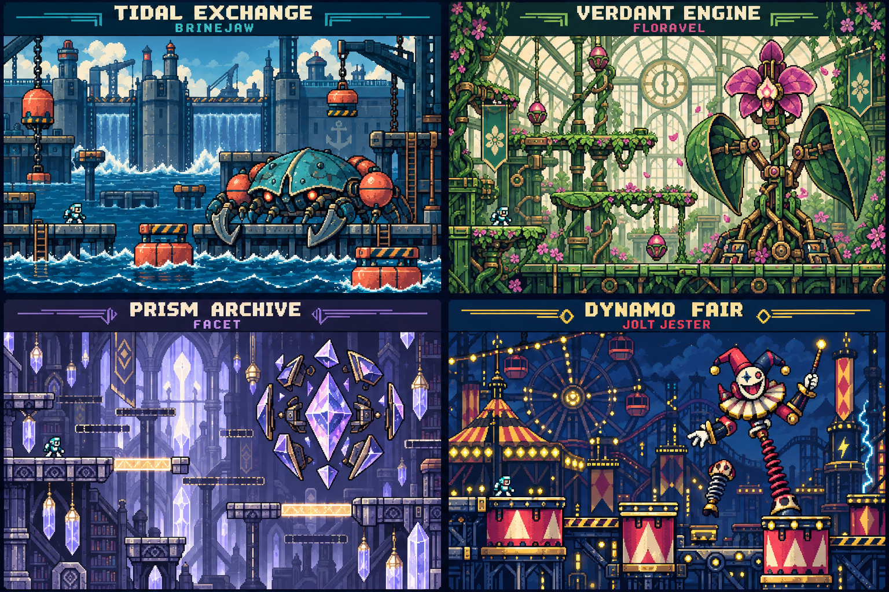

# Chrono Circuit Eight Stage Expansion Proposal

Version 0.7 design proposal • 15 September 2026

Expand Chrono Circuit into an eight-stage action platformer with four new mathematical strands, four new bosses and four new attacks. The priority is a better game: distinctive movement challenges, readable enemies, satisfying weapons and a consistent 16-bit visual identity. Each new stage must be recognizable from its route, silhouette and movement before its name appears.

This proposal defines the complete expansion and the repair of Tempo’s art. It is a design package for review and implementation; the attached v0.6 game has not been modified. Numerical balance values below are starting targets, not playtest results.

| New stage | Guardian | Signature play | Mathematics | Reward |
|---|---|---|---|---|
| Tidal Exchange | Brinejaw | Water changes which routes and buoy platforms are usable | Schedules and transfers | Depth Charge |
| Verdant Engine | Floravel | A route grows, retracts and braids upward around safe landings | Multi-step journeys and deadlines | Bramble Roller |
| Prism Archive | Facet | Read and switch solid light bridges through a compact hub | Compare durations and differences | Prism Orbit |
| Dynamo Fair | Jolt Jester | Transfer between gondolas and timed mechanical rides | Seconds, conversions and repeated durations | Arc Thread |

The finished campaign contains eight selectable stages, 24 mandatory clock gates and eight earned powers. At the default two questions per gate, a complete fresh eight-stage circuit contains 48 required questions, plus any practice checks needed after demonstrations. The four new stages add 12 gates and a target of 48 structural question templates.

Keep the existing control vocabulary: run, jump, fire, climb, use clock, use power and swap power. Retain the single jump. All mandatory routes and bosses remain completable with the basic blaster; special weapons create meaningful advantages. Boss fights remain uninterrupted action.

**Production recommendation.** Standardize Tempo and the asset pipeline first. Build and polish Tidal Exchange as the first complete new stage, then deliver the other three against the same quality gates. All four are part of the proposed scope; a development milestone must not be presented as a completed expansion.

<!-- PAGE -->
# What v0 6 establishes and what needs to change

The uploaded build is a useful foundation: four playable stages, three gates per stage, moving bosses, weapon rewards, configurable question counts and replay rules. Source inspection also identifies why simply adding more rooms would produce diminishing returns.

| Finding in the supplied code | Consequence for this expansion |
|---|---|
| Every stage has 13 rooms and gates in positions 3, 7 and 10 | Give the new stages different route structures, gate spacing and changes to the environment |
| Twelve enemy designs share seven behavior labels | Budget eight new behavior patterns, plus four deliberate variations of existing behaviors |
| Tempo uses hero-art.js; foundry actors use raster crops; later actors and portraits use separate Canvas drawings | Replace the competing art approaches with one visual standard and one asset catalogue |
| Running changes frames every 6 pixels, about 17.5 frames per second at full speed | Rebuild foot contacts and timing together; changing the pictures alone is insufficient |
| Idle has no independent loop; rising and falling share one pose | Add explicit idle, takeoff, apex, descent, landing and reaction states |
| Platforms currently resolve landing on their top faces | Budget side and ceiling collision, stateful mechanisms and explicit room exits before building new routes |
| The current timetable view is prose with three choices | Add real schedule tables and answer types that assess route feasibility |
| Four wrong answers reveal a usable answer | Require a fresh equivalent practice check after a demonstration before crediting that item |

**Retain the working systems.** Fresh replays close every gate while preserving weapons and the learning report. Deaths and unfinished-run continuation preserve completed questions and partial-gate progress. Saving the current question’s attempts and support state is an additional expansion requirement. Keep the 1–10 questions-per-gate setting, default 2, fixed when a run starts. Preserve swept projectile collision, the corrected firing height, separate input sources and cancellation of held controls on focus loss.

**Preserve Railox’s arena.** Its reachable drop-through ledges and Down plus Jump are part of the repair. New artwork must fit the collision geometry. A prettier flat floor would reintroduce the unavoidable-damage problem.

**Current physical limits.** The logical screen is 320 × 180 and Tempo’s collider is 14 × 29. The existing single jump rises about 36 logical pixels and covers roughly 67 pixels at the same landing height in an ideal full jump. Initial ordinary jumps should stay within about 28 pixels of rise and 50 pixels of horizontal gap, then be validated using the actual takeoff and landing edges. These are design margins, not a substitute for traversal tests.

<!-- PAGE -->
# Four new districts with one visual language

The board establishes architectural motifs, palettes and boss silhouettes. It is concept art, not a playable screenshot or a measured level map. Production backgrounds must be simpler, especially the greenhouse foliage, so moving threats remain readable at 320 × 180.

| District | Dominant forms | Palette anchors | Restoration visible after math |
|---|---|---|---|
| Tidal Exchange | Heavy quays, circular buoys, low wide machinery | Navy 092738; turquoise 238A94; coral DF7253; foam F4E3BE | Locks move, floats rise and floodwater exposes a new route |
| Verdant Engine | Copper stems, ribbed glass, broad leaves | Green 173C32; leaf 6F9854; copper B7773E; orchid D4679C | Dormant bridges unfold and seed lifts begin moving |
| Prism Archive | Angular vaults, split diamonds, long vertical shafts | Ink 211B37; lilac 9B8CC4; crystal E5E7F4; amber EBBE62 | Dark bridge outlines become solid illuminated surfaces |
| Dynamo Fair | Drum cylinders, cable wheels, chevrons, asymmetry | Navy 111F39; yellow F7CE43; raspberry CB425D; cyan 74D5DD | Gondolas depart, drums synchronize and the fair lights return |

Enemy shots use a bright core and dark rim. Friendly shots retain a separate silhouette. Solid ledges have a continuous bright upper edge; inactive bridges are broken outlines; dangerous surfaces carry repeated teeth or warning marks. Color supports these distinctions but never carries them alone.

<!-- PAGE -->
# Tempo character model

Tempo remains the same original character: chestnut hair, amber visor, burnt-orange scarf, dark teal suit, cream chest accent, compact boots and a luminous wrist dial. The new model separates the head, torso, hips and limbs clearly. The stance should look balanced and alert, with both feet carrying weight.

Use the large standing model as the proportion reference. The smaller drawings establish motion silhouettes, not finished animation frames. The four run pictures are key-pose references; they are not a complete alternating-foot loop. The rear climbing view shows the visual treatment, while the accepted v0.6 distance-driven climbing behavior remains authoritative.

The wrist device must read as the source of Pulse Sparks without turning Tempo’s entire forearm into a different character design. Shooting changes the arm pose while the legs continue their action. Costume, body mass and head scale remain stable across all states and facing directions.

<!-- PAGE -->
# Tempo animation production contract

Use Olivia’s proven sequence: establish the reference, create coherent raster poses, normalize their placement, define the loop deliberately and inspect it inside the game. Keep the original generation sheets as art sources. Export prepared transparent textures separately; do not ship an unprocessed contact sheet as the character.

| State | Initial frame budget | Motion and transition rule |
|---|---|---|
| Idle | 6 | Independent slow breath and occasional visor glint; planted boots; return scarf to a neutral rest |
| Run | 8 | Two complete alternating steps with contact, compression, passing and flight; start near 12 fps at full speed and tune against travel |
| Run while firing | 8 matched variants | Same leg phase and body position as running; wrist aims at the real projectile origin |
| Air | 2 rising, 1 apex, 2 falling | Change state from vertical velocity; keep head and torso scale stable |
| Takeoff and landing | 2 each | Short compression and release; never delay the physics or lock the controls |
| Climb | 8 | Advance with signed ladder movement; hold still when stopped; reverse on descent; hands meet the existing rung spacing |
| Climb while firing | Matched arm variants | Retain the ladder phase and the supported hand; no sideways body snap |
| Hurt and restore | 3 hurt, 4 victory | Clear recoil and restrained celebration; preserve collider and input responsiveness |

**Registration.** Use a shared padded 48 × 48 export canvas, with Tempo’s main body occupying approximately 32 × 40 logical pixels. All frames use the same foot pivot and the same 14 × 29 gameplay collider. Extra scarf and wrist pixels live in padding. A frame never changes scale to fill its crop. Align feet to the collider bottom and register the firing socket to the existing projectile origin, including the corrected p.y + 18 shot height.

**Timing.** Drive the run phase from intentional ground travel, with timing chosen to avoid sliding feet. Being carried by a lift must not start the running animation. Use a separate idle clock. Switch facing without restarting the stride. Preserve the airborne phase when firing. Keep animation state in the frame-cache key, including rise, apex and fall, so a cached pose cannot erase a state transition.

**Approval gate.** Review idle, run, run-fire, jump, landing, climb, climb-fire and left-facing transitions at native scale and enlarged scale. Watch at least 20 seconds of continuous movement across the actual backgrounds. Reject changing head size, drifting boots, intersecting limbs, muzzle jumps, floaty contact poses and scarf motion that obscures the body. Automated checks cover registration and loading; human visual inspection decides whether it looks good.

<!-- PAGE -->
# Campaign art and sound standards

All eight stages use the same pixel density, outline weight, lighting direction and shading economy. Hero, enemies, bosses, portraits, pickups and interactive machinery belong to one asset family. Backgrounds may use broader painted pixel clusters, but gameplay objects keep crisp edges and modest detail. Avoid scaling one actor from a highly detailed illustration while drawing its neighbor as a few rectangles.

| Stage | Visual identity to retain or establish | Musical direction |
|---|---|---|
| Furnace Run | Soot, amber furnaces, bronze gantries, Pendula’s hanging arc | Preserve its industrial pulse; improve arrangement and loop length |
| Midnight Metro | Signal red, charcoal tunnels, steel rails, Railox’s low locomotive mass | Preserve its urgent transit rhythm and bass emphasis |
| Bell Tower | Violet dusk, bells, clock faces, Ricochet’s lean angular silhouette | Preserve bright bell figures with a distinct syncopated lead |
| Sky Dial | Open cyan sky, canvas airships, tall masts, Vesper’s broad wings | Preserve a buoyant soaring lead with open harmony |
| Tidal Exchange | Cool docks with warm flotation tanks; Brinejaw stays low and broad | 132 BPM target; swung bass, mallet lead and short brass-like answers |
| Verdant Engine | Greenhouse ribs and copper vines; Floravel is tall and rooted | 138 BPM target; flowing arpeggios, plucked lead and an uneven melodic phrase |
| Prism Archive | Quiet angular geometry and hard light; Facet is a suspended diamond | 126 BPM target; glassy FM-like timbres, spacious melody, irregular accents over a steady beat |
| Dynamo Fair | Mechanical carnival cylinders; Jolt Jester is asymmetric and springy | 150 BPM target; bright synth brass, call-and-response hooks and driving drums |

New tracks should each have at least a 60–90 second arranged loop with an introduction, contrasting middle and return. A different instrument on the same eight bars does not count as a new song. Reuse synthesis infrastructure where practical, but give each stage its own melody, bass line, harmony, percussion pattern and boss arrangement. These BPM values are compositional starting points.

Boss warning sounds must remain audible over music and have corresponding visual cues. Math screens reduce musical intensity without counting down or pressuring an answer. Reduced-motion mode removes camera shake, busy trails and decorative flashing; it does not remove the tell that makes an attack avoidable.

The stage-select screen expands to eight portrait cards, arranged as two rows of four where space permits. Use larger stacked rows on narrow screens. Every portrait must depict the same model as its in-game boss. Show the stage’s skill focus, earned weapon and restored state; selecting an advanced strand should not require beating an unrelated boss first.

<!-- PAGE -->
# Tidal Exchange level plan

**Identity.** A flood-control freight harbor where departure clocks have fallen out of sync. The player reads changing water height and uses the same location differently after a lock is restored. The mood is weighty, mechanical and open-air. Target 11 sectors including the boss, with approximately 8–10 minutes of action on a practiced run; math time is additional and untimed.

**Signature mechanic.** Slow, telegraphed water-level changes carry buoy platforms between fixed landings and cover or expose lower walkways. Tempo does not swim. Deep water is a clearly marked recovery hazard with a nearby safe reset, and every transition preserves a reachable refuge. Water changes occur on a deterministic cycle or after a clock gate, never at random.

| Sectors | Play sequence and purpose |
|---|---|
| 1–2 | Learn buoy boarding over a shallow safe basin, then transfer between two floats at different phases |
| 3 | Gate A restores the loading schedule and opens the lower quay |
| 4–5 | Return briefly through the changed quay; use a dry lower route, then climb back onto an upper float circuit |
| 6 | Gate B synchronizes a transfer lock and records the checkpoint |
| 7–8 | Ride a cargo raft through marked spillway pulses; step off into shelters, then reboard; combine height reading with one enemy at a time |
| 9 | Gate C selects a feasible service before a deadline and stabilizes the breakwater |
| 10–11 | Cross a short combined breakwater sequence, recover in its safe vestibule and enter Brinejaw’s dock |

The brief return through a changed place is the payoff. Keep it to about one screen of purposeful traversal. Use explicit exit links for the lower and upper connections; do not disguise a new branch as an unreachable right-edge trigger.

| Enemy | Behavior and player decision |
|---|---|
| Clamp Skater | New pattern: boards a buoy, clamps it at the next stop and announces a low claw sweep. Shoot it to release the platform or pass using the fixed refuge route |
| Wake Buoy | New pattern: drifts across a marked lane and leaves three short-lived wake hazards. Move into the gap behind it; its body takes basic shots |
| Lamprey Drone | Flying-enemy variation: follows the rising water line, then pauses before one diagonal shot. Its height changes the safest place to engage |

**Gate effects.** Gate A changes the accessible elevation, Gate B changes platform synchronization, and Gate C creates the boss approach. Each answer changes the world visibly within a short, skippable reveal. The player remains safe until control returns.

<!-- PAGE -->
# Brinejaw boss and learning gates

Brinejaw is a broad armored horseshoe-crab machine with orange buoy tanks and heavy anchor claws. It moves between two dock positions rather than chasing continuously. The arena has a continuous recoverable floor, raised side docks and two slowly moving floats. No dodge requires jumping over its full body.

| Attack | Tell and required response | Recovery opening |
|---|---|---|
| Anchor Rake | One claw rises and a low sweep lane lights up. Step onto a side dock before the sweep crosses the floor | The raised tank and forward body remain in a reachable firing lane |
| Ballast Drop | Both tanks inflate; one float’s landing outline appears. Move to the other dock or marked floor refuge | Brinejaw settles for about 0.9 seconds with its wet tank exposed |
| Sluice Fan | Mouth grille flashes in three beats. Low water projectiles leave one wide, signaled gap | Approach through the gap and fire; no overlapping body charge |

Below half health, Ballast Drop can be followed by a shorter second drop, but the second landing is telegraphed after the first. Never run two independent attacks simultaneously. Initial tells should last roughly 0.7–1.0 seconds, with recovery near 0.8–1.1 seconds, then be tuned on iPad.

**Primary counter.** Arc Thread from Jolt Jester conducts into the exposed wet tank, adds the weakness bonus and cancels one Sluice Fan windup. A resistance timer prevents repeated cancellation from pinning the boss indefinitely. Basic blaster hits remain valid from the docks.

**Reward.** Depth Charge is a visible lobbed explosive: one bounce, a short fuse and a circular blast. It reaches around obstructions without replacing the straight blaster. It is the intended counter to Facet’s shutters. It is an attack, not a required underwater ability.

| Gate | Representative problem | Answer |
|---|---|---|
| A Waiting time | Arrive at 9:35 AM; the next departure is 9:55 AM. Find the wait | 20 minutes |
| B Transfer time | Arrive at 12:35 PM; transfer takes 10 minutes. Departures: 12:40 PM, 12:50 PM, 1:10 PM. Choose the earliest catchable service | 12:50 PM |
| C Feasible journey | Arrive at 12:35 PM; transfer takes 10 minutes. Using the departure-and-arrival table, choose a service you can catch that arrives no later than 2:00 PM. | B; A is missed and C is late |

Use the complete departure-and-arrival table on the learning progression page for Gate C; its screen must repeat every required arrival, transfer and deadline detail independently of earlier questions. State that boarding is allowed when ready exactly at departure time. Vary feasible rows across generated problems. A timetable is not a multiple-choice question with decorative column lines.

<!-- PAGE -->
# Verdant Engine level plan

**Identity.** An enormous mechanical greenhouse winds around an irrigation engine. Glass ribs, copper vines and broad leaves form a rising route. Target 12 sectors including the boss and 9–11 minutes of practiced action. The player should feel that a living machine is assembling the path ahead.

**Signature mechanic.** Platforms grow to their full width before becoming solid, hold, then fold away with a clear warning. Fixed seed pods act as safe landings between growth waves. Later sections braid two growth routes around the same central trunk. Retraction never cuts through a player: occupied leaves complete a safe departure interval before folding.

| Sectors | Play sequence and purpose |
|---|---|
| 1–2 | Cross one unfolding leaf over solid ground; Gate A powers the first growth sequence |
| 3–4 | Climb through a three-leaf staircase, then traverse a horizontal vine whose stable pods break up the timing challenge |
| 5–6 | A seed lift connects the two routes; Gate B budgets the irrigation journey and saves a checkpoint |
| 7–8 | Choose a lower sheltered strand or a higher moving strand; both rejoin before the next gate and require the same mathematics |
| 9–10 | Cross a route that grows ahead and retracts behind, with refuges; Gate C restores the night irrigation cycle |
| 11–12 | Combine growth waves with a short ladder transfer, enter a quiet flower chamber and fight Floravel |

Route variation comes from height, direction and timing. Use leftward transfers and upward exits where they help the greenhouse feel spatially connected. The camera shows the next stable pod before the player commits. There is no blind timed climb and no new double jump hidden in the geometry.

| Enemy | Behavior and player decision |
|---|---|
| Seed Watcher | New pattern: visibly winds up while the player moves through its sight lane; stopping freezes the windup briefly rather than resetting it. Pause on a pod, aim and remove it |
| Root Weaver | New pattern: sends a marked thorn sequence along two adjacent floor zones. Read the order and step into the zone that has already cleared |
| Pollen Moth | Swooping-enemy variation: circles a fixed pod, then commits to its announced diagonal. Decide whether to clear it before beginning a growth transfer |

All three enemy bodies take ordinary shots. Their threat comes from placement and timing. Limit the first combination to one enemy plus one growth rule; the final sequence may combine two known rules only after each has been shown safely.

**Engineering boundary.** Growth platforms use stateful rectangular landing surfaces and visual unfolding, not arbitrary rotating leaves or slope physics. If the artwork bends a leaf, its visible landing edge must still match the collision surface.

<!-- PAGE -->
# Floravel boss and learning gates

Floravel is a tall rooted orchid automaton with two fan-shaped leaves and a bright central face. Its segmented stalk transfers between three root sockets while its feet remain attached to the arena. Two permanent side steps let a basic-blaster player reach the face. Growing leaves can offer better positions but never remove the only safe landing.

| Attack | Tell and required response | Recovery opening |
|---|---|---|
| Vine Sweep | The stalk bends and one floor lane grows a dotted vine outline. Move to the opposite socket or a permanent step | Face pauses at a known height after the sweep |
| Seed Rain | Three pods rise; landing markers appear with a deliberate gap. Stand in the gap rather than racing blindly | The face opens while empty pods retract |
| Leaf Clap | Both leaves spread wide, then converge at one marked height. Stay below on the floor or above on a side step | Leaves remain folded for a short clear firing window |

In phase two, Floravel changes root socket between attacks and alternates high and low Leaf Claps. It does not remove the basic firing route or speed up every animation. One incoming attack is always legible before the previous safe interval ends.

**Primary counter.** Updraft Burst catches the raised flower and leaf joints. Its bonus makes attacking from below worthwhile, and one accepted hit during Seed Rain can destroy an unopened pod. This expands the usefulness of Vesper’s existing reward.

**Reward.** Bramble Roller travels along a floor as a spiked wheel, drops off an edge and dissipates after a short lifetime. It does not climb walls or cross large gaps. It is useful against grounded enemies while Tempo jumps, and it catches Jolt Jester’s springs during grounded windups.

| Gate | Representative problem | Answer |
|---|---|---|
| A Combine steps | Start at 9:20 AM. Travel 35 minutes, stop for 10, then travel another 25 | 10:30 AM |
| B Work backward | Arrive by 2:10 PM. The route takes 20 minutes walking, a fixed 15-minute wait and 45 minutes travelling. Find the latest start | 12:50 PM |
| C Cross midnight | Leave at 11:25 PM Tuesday. Travel 40 minutes, stop for 15, then travel 35 | 12:55 AM Wednesday |

Present the journey as a short sequence of labelled cards. A hint exposes a subtotal or landmark, then asks the learner to finish. Later variants change the unknown: start, finish, missing stop or total duration. Do not merely change the three numbers in an otherwise identical sentence.

Clock answers must include the day when crossing midnight is assessed. The visible day labels are a presentation of the engine’s signed day offset, not a separate guessable question.

<!-- PAGE -->
# Prism Archive level plan

**Identity.** A quiet suspended archive of crystal timing records. The route is a compact central chamber with two compulsory wings, illuminated bridges and shutters. Facet’s hard angular forms contrast with the organic garden and heavy docks. Target 10 sectors including the boss and 8–10 minutes of practiced action.

**Signature mechanic.** Bridge groups have explicit solid and inactive states. Safe floor pads toggle a nearby group; a lit top edge and a distinct tone confirm solidity. Critical bridges do not vanish under Tempo because a background timer expired. Later puzzles combine a manually selected bridge route with a separately telegraphed sweeping beam.

| Sectors | Play sequence and purpose |
|---|---|
| 1–2 | Enter the central hall, demonstrate a safe bridge toggle and solve Gate A to power the west wing |
| 3–4 | Cross the west stacks using alternate bridge groups; learn the beam shutter over a permanent floor before crossing a gap |
| 5 | Gate B aligns the comparison lens and saves the checkpoint |
| 6–7 | Re-enter the central hall at a higher level, then complete the east wing with bridges and a delayed echo enemy |
| 8 | Gate C compares overnight routes and creates the direct upper bridge to the guardian |
| 9–10 | A short three-platform light sequence tests the combined rules, then the bridge opens into Facet’s vault |

The hub is a compact landmark, not a maze. Use a persistent two-wing schematic with the active destination highlighted. Opening a bridge gives a short visual preview of where to go next. Wrong local bridge choices always have a safe reset pad and cannot bypass a clock gate.

| Enemy | Behavior and player decision |
|---|---|
| Echo Scribe | New pattern: records a brief trail of three visible player positions, then sends a delayed attack through those positions. Move to a fresh lane after the recording tell |
| Index Wisp | New pattern: paints a stationary beam lane, waits, then fires through a shutter opening. Cross after the beam, or remove its exposed body from a safe ledge |
| Prism Crawler | Patrol variation: follows the currently solid bridge group, changing its route when the player toggles that group. Clear it before boarding |

Use luminous strips sparingly. The room must still read in grayscale: solid edges are continuous, inactive edges broken, beams have a moving core and danger chevrons. Decorative crystals cannot look like platforms.

**Engineering boundary.** This stage requires switch state, explicit exits and saved bridge state. Beams are bounded rectangular hazards. The design does not require freeform optical ray tracing or arbitrary mirrors.

<!-- PAGE -->
# Facet boss and learning gates

Facet is a suspended diamond core surrounded by four large angular shutters. It slides between three fixed anchor positions and rearranges its panels. The arena uses a permanent floor and two low side steps. The panels frame readable firing lanes; they do not create an unexplained invulnerable boss.

| Attack | Tell and required response | Recovery opening |
|---|---|---|
| Shutter Sweep | A panel pair rotates to horizontal and a beam lane appears. Move to a step or the open floor lane before the sweep | Core remains visible through the opposite opening |
| Delayed Reflection | A ghost marker records Tempo’s position, then a shard travels to that fixed point. Move after the marker locks | Facet holds its anchor while the shard resolves |
| Prism Descent | The core moves above a marked lane and lowers between its panels. Leave the lane; do not attempt to jump over the full machine | Core drops to a height reachable by normal shots |

Below half health, the boss chooses the next anchor from two legal positions and sends a second delayed shard with its own marker. It never redirects a locked attack mid-flight. There is at most one moving body threat and one projectile pattern at a time, with a validated safe route.

**Primary counter.** Depth Charge bounces through a visible opening beneath a shutter and its blast reaches the core along an unobstructed path. Shutters do not receive an exception to solid-wall rules. A weakness hit briefly pushes a panel aside, creating a longer basic-blaster opening. The bomb’s fuse and bounce must make this repeatable from a marked low side step. Its proposed launch rises only about 12 pixels above the muzzle, so prototype the launch region and opening before approving the arena.

**Reward.** Prism Orbit creates two damaging crystal shards around Tempo for a short time. Each can strike enemies while he climbs or crosses a gap. It is a close-range attack, not invulnerability: it does not cancel body contact or every projectile. During a telegraph or recovery interval, its reach can clip Pendula’s exposed outer mechanism while Tempo remains outside the collision body. This does not make every close pass safe.

| Gate | Representative problem | Answer |
|---|---|---|
| A Compare durations | A takes 45 minutes; B takes 1 hour 5 minutes. How much longer is B? | 20 minutes |
| B Calculate both | A runs 8:35–9:50 AM. B runs 9:10–10:05 AM. Which is shorter, and by how much? | B by 20 minutes |
| C Overnight comparison | A runs 10:50 PM Tuesday–12:20 AM Wednesday. B runs 11:15 PM Tuesday–12:30 AM Wednesday | B by 15 minutes |

Use a two-part response when needed: select the route and enter the difference. Check both parts. Include equal-duration cases. A hint aligns both duration bars at zero so that an earlier arrival is not mistaken for a shorter journey.

<!-- PAGE -->
# Dynamo Fair level plan

**Identity.** An electric fairground whose rides have lost their timing. Huge cylinders, cable wheels and striped lamps create a playful district with a fast original song. The stage alternates short ride sequences with stable platforms, producing momentum without taking away control. Target 12 sectors including the boss and 9–11 minutes of practiced action.

**Signature mechanic.** Ride clusters combine rotating gondola positions with flat landing decks and deterministic drum lifts. Tempo can step onto a moving ride, stay aboard or transfer to a visible fixed landing. Ride movement is learned over recoverable ground before it is used above a gap. No required action depends on listening to the music beat.

| Sectors | Play sequence and purpose |
|---|---|
| 1–3 | Learn a low gondola orbit, transfer to a fixed booth and cross a two-drum lift sequence with a clear refuge |
| 4 | Gate A converts the ride timing and starts the main wheel |
| 5–6 | Ride part of the wheel, exit onto a stable balcony, then meet a magnetic usher before combining its field with a ride |
| 7 | Gate B calculates repeated cycles and synchronizes the carousel; save the checkpoint |
| 8–9 | Cross alternating ride clusters with a stable island between them; a juggler introduces a visible delayed blast |
| 10 | Gate C finds time remaining after setup and ride cycles, opening the finale |
| 11–12 | A short travelling-gondola finale combines known transfer rules; stop at a safe recovery booth, then enter Jolt Jester’s ring |

The set piece is a sequence of controlled transfers, not forced autoscrolling. The camera can anticipate travel direction, but it cannot carry the player into an unseen hazard. A missed gondola returns; a falling platform has an accessible replacement route. Use a screen shake and celebratory lighting burst only at the restored-wheel reveal, with a reduced-motion alternative.

| Enemy | Behavior and player decision |
|---|---|
| Magnet Usher | New pattern: advertises a brief directional field with arrows. It applies a bounded airborne push or pull, then rests. Clear it or wait for the field before jumping |
| Fuse Juggler | New pattern: throws two bouncing charges that visibly settle before detonating. Land away from their marked blast rings or destroy them with basic shots |
| Ticket Runner | Charger variation: commits to a highlighted strip across a stable island. Use the ride to change elevation, or jump after its route locks |

**Engineering boundary.** Gondolas use existing orbit-capable moving-platform math with improved boarding and camera handling. Rotating art does not imply a rotating collision rectangle: each ride has a visibly flat landing deck. Do not add general slope physics or player rotation to deliver this stage.

<!-- PAGE -->
# Jolt Jester boss and learning gates

Jolt Jester is a spring-legged clockwork performer with an asymmetric hat, ceramic face and conductor baton. Its silhouette stretches through articulated springs rather than scaling the whole sprite. The arena has a wide stable floor, two low balcony ledges and two drum decks that move only during clearly separated transitions.

| Attack | Tell and required response | Recovery opening |
|---|---|---|
| Spring Stamp | The jester compresses, points at a landing marker and hops there. Leave the marker after it locks; balconies remain available | Springs stay compressed on landing, exposing a grounded target |
| Baton Circuit | A visible spark travels around the two drums before a low arc crosses the floor. Board a deck after the spark passes | Jester conducts from the floor while the arc expires |
| Firework Toss | Two charges follow visible lob arcs and settle with blast rings. Move to the unmarked island; neither blast may cover all floor refuges | Jester bows for about one second before choosing the next attack |

Phase two reverses the next drum sequence and changes the order of tosses. It does not increase all speeds at once. Drum motion and body landings are mutually scheduled so the safe balcony cannot move away during a required dodge.

**Primary counter.** Bramble Roller catches the grounded springs during compression, adds bonus damage and can interrupt one Spring Stamp windup. The boss subsequently gets a short resistance period. This rewards using a floor attack at the correct time rather than waiting for an airborne target to happen to touch it.

**Reward.** Arc Thread is a short straight electric shot that may chain to one nearby visible secondary target. The first target still requires aiming. It cannot pass through solid walls or seek an unseen enemy. It is especially useful against paired enemies and Brinejaw’s exposed tank assembly.

| Gate | Representative problem | Answer |
|---|---|---|
| A Convert units | Express 2 minutes 15 seconds in seconds | 135 seconds |
| B Repeat a duration | Four cycles each take 2 minutes 15 seconds, consecutively with no gaps | 9 minutes |
| C Remaining time | A 5-minute budget includes 35 seconds of setup and three cycles of 1 minute 20 seconds | 25 seconds remain |

Use labelled hours, minutes and seconds fields or an equivalent exact-unit entry control. Show the relationship of 60 seconds to one minute when support is needed. Accept equivalent exact forms unless a particular target unit is the skill being assessed. No rounding, hidden reset time or unstated wait is allowed.

<!-- PAGE -->
# One connected boss weakness cycle

Each row gives the defeated guardian, the earned power and its intended next target. The cycle is a route suggestion, not a lock on stage selection. Every boss remains beatable with the normal blaster.

| Defeat | Earn | Primary target | Why the counter is useful |
|---|---|---|---|
| Pendula | Beat Brake | Railox | Slows its aggressive ground movement and strengthens hits during the effect |
| Railox | Transit Lance | Ricochet | Piercing travel punishes its cross-arena movement |
| Ricochet | Echo Disc | Vesper Wing | Outbound and returning paths cover its aerial sweep |
| Vesper Wing | Updraft Burst | Floravel | Rising spread reaches the high flower and leaf joints |
| Floravel | Bramble Roller | Jolt Jester | Ground travel catches compressed springs during a windup |
| Jolt Jester | Arc Thread | Brinejaw | Electricity conducts into the exposed tank assembly |
| Brinejaw | Depth Charge | Facet | Bouncing explosives and blast radius reach around shutters |
| Facet | Prism Orbit | Pendula | Orbiting shards reach the outer mechanism during close safe passes |

**Preserve learned behavior.** Updraft Burst retains its existing bonus against Pendula as a secondary weakness. The first three primary links remain intact. Existing saves keep all earned powers and equipped selections. The new primary path connects all eight bosses without making an already useful weapon suddenly ineffective.

**Feedback.** A weakness hit produces a distinct crack effect, sound and short reaction. The reward demonstration explicitly names one useful target and shows the attack geometry. The weapon description remains available in pause. A discovered matchup can appear on the stage card; no external guide should be required to understand what happened.

**Fairness.** Ordinary hits always give visible damage feedback. Any temporary shield needs an obvious open firing lane or exposed phase. No attack may require the intended weakness weapon to create the only opportunity to damage a boss. Interrupt reactions have a cooldown so repeated special attacks cannot erase the entire fight.

**Balance basis.** v0.6 uses additive weakness bonuses of 2 damage and a 0.24-second boss damage cooldown. Keep that familiar model initially. Evaluate damage from accepted hits per activation; simultaneous pellets are not automatically additive. The proposed counter reactions are limited tactical benefits, not hidden multipliers.

<!-- PAGE -->
# Special weapon design and balance

The normal Pulse blaster remains the dependable default. The four new rewards extend attack geometry without adding traversal controls. Keep separate FIRE and POWER inputs and the existing swap action. Holding POWER may repeat an attack only after its cooldown and energy check; no charge-release control is required.

| New power | Initial behavior | Initial cost and hit rule | Limitation |
|---|---|---|---|
| Depth Charge | Lob at roughly 150 px/s horizontally and −130 px/s vertically; one bounce; detonate after about 0.8 s with a 26 px radius | 2 energy; 3 damage, +2 against Facet; at most one boss hit per charge | Delayed aim; cannot explode through an unrelated solid wall; maximum two charges active |
| Bramble Roller | Travels along ground at about 140 px/s for up to 1.5 s; falls at an edge | 2 energy; 2 damage, +2 against Jolt Jester; one hit per target per roller | Poor against aerial targets and gaps; maximum two active |
| Prism Orbit | Two shards orbit at about 26 px radius for 1.6 s | 2 energy; 2 damage, +2 against Pendula; maximum two accepted boss hits per activation | Close range; body contact still hurts; one orbit active, no stacking |
| Arc Thread | Straight shot of about 110 px reach; chains once within 48 px of a first visible hit | 2 energy; 3 damage, +2 against Brinejaw; one hit per target per activation | Requires initial aim; line-of-sight check; no repeated hit on the same boss through a second part |

These values are provisional. Retain the existing 8-point energy capacity initially, giving four activations from full. A boss retry restores at least the energy held at arena entry, so learning a new fight cannot permanently exhaust a reward. Do not repeatedly drop energy inside the arena as a substitute for balanced costs.

**Shared rules.** Powers have stable ownership and hit identifiers. A blast hitting a core and a decorative tank counts once unless that boss explicitly has independent targets. Clamp active projectiles and effects to keep iPad performance predictable. Weapon particles may decorate a hit but must not hide a boss tell.

**Encounter utility.** Depth Charge clears a clustered landing beyond a low obstacle. Bramble Roller attacks a grounded patrol while Tempo crosses overhead. Prism Orbit damages nearby enemies during a close approach; it is not a shield. Arc Thread rewards lining up two nearby enemies. Each reward gets one safe demonstration and one later optional opportunity; mandatory clock gates cannot be bypassed by any power.

**Victory target.** Begin with roughly 24–28 health for new bosses, then tune from observed play. A confident player who lands every basic shot could deal that damage in roughly 7–8 seconds; movement and dodging will lengthen an ordinary fight. Aim for a first successful player to learn the three-pattern set, but allow faster skilled wins. Do not raise health or impose long invulnerability waits just to hit a duration target. Weakness use should create a visibly easier fight.

<!-- PAGE -->
# Learning progression and meaningful replay

Each new stage has three gates with four structural templates per gate. At the default two questions, select a balanced subset; at one question, rotate the core templates over successive fresh runs. Numerical variation provides practice, but it does not replace variation in the unknown, representation and reasoning step.

| Strand | Representations to include | Progression beyond the sample questions |
|---|---|---|
| Schedules | Real timetable, route strip, arrival and departure cards | Wait, transfer feasibility, latest catchable service, arrival deadline |
| Journeys | Ordered steps, timeline, short narrative | Start, finish, missing step, multi-day boundary with an explicit day |
| Comparisons | Two trip panels, aligned duration bars, mixed units | Longer or shorter, difference, equal intervals, latest finish versus longest duration |
| Units | Numeric units, grouped cycles, duration budget | Convert, combine, repeat, divide into exact groups, find remaining time |

For the Tidal Exchange capstone, display a compact schedule such as the following. State that the player arrives at 12:35 PM, needs 10 minutes to transfer and must arrive no later than 2:00 PM.

| Service | Departure | Arrival |
|---|---|---|
| A | 12:40 PM | 1:10 PM |
| B | 12:50 PM | 1:35 PM |
| C | 1:10 PM | 2:10 PM |

Service B is feasible. A is missed despite its earlier arrival; C can be caught but arrives too late. Generate schedules with different feasible rows, including variants that ask for the earliest feasible arrival rather than the earliest departure. Where no route is feasible, include an explicit “none” answer instead of forcing a wrong choice.

**Support sequence.** First show a specific hint. Then expose a landmark, subtotal or one relevant table row. If the learner still needs a worked demonstration, show the method and require a fresh equivalent practice check before that item earns gate credit. Repeated support remains safe and untimed. Record demonstration plus practice separately from independent success.

Do not impose an unlimited ladder of extra compulsory questions: the replacement check completes the supported item. If difficulty persists, reduce the numbers or expose a partial scaffold while retaining the same reasoning step. An adult may end the run, but ordinary repeated wrong clicks must not become the fastest path to the boss. The check earns credit only after an unrevealed final response is correct. Hints may expose intermediate steps. Revealing its final answer replaces the single outstanding check with another variant; it does not add another gate item.

**Save and reporting.** Persist the original item, practice-check variant, entered parts, attempts, hints and status: working, check pending or credited. Clock exits and reloads resume that state without regeneration. Only credited items count toward the gate; credit and gate completion save together. Extend practice modes and the parent report to all eight strands deliberately. Keep action assist separate from mathematical difficulty, and present an advanced-content hint without locking the child into boss order.

<!-- PAGE -->
# Engine work required for the proposal

This expansion can remain a self-contained static browser game with no server, runtime AI or paid dependency. However, the new stage ideas need deliberate engine work. A large list of new room objects alone will not deliver them.

| Workstream | Required change | First stage that proves it |
|---|---|---|
| Collision and moving surfaces | Add opt-in solid side and ceiling tags; keep legacy platforms one-way; protect riders when a surface grows, retracts or changes height | Tidal Exchange |
| Room graph | Replace assumed right-edge progression with explicit exits, spawn positions, prerequisites and a no-softlock reset | Tidal Exchange, then Prism Archive |
| Mechanism state | Shared off, warning, active and recovery states; save relevant lock, growth and bridge changes | All four |
| New encounter controllers | Eight new behavior patterns with bounded sensing and attack schedules; four variations of existing patterns | Two new patterns per stage |
| Boss definitions | Data-driven primary and secondary weaknesses, limited interrupt reactions, attack scheduling and legal safe positions | Brinejaw |
| Duration model | Add exact integer-second durations while preserving existing minute-based clock points and day offsets | Dynamo Fair |
| Learning interface | Real tables; route plus difference answers; numeric unit entry; named days; worked-example practice check | Tidal Exchange |
| Asset catalogue | Sprite sheets, frame metadata, pivots, hit flashes and shared portraits; fail visibly if an asset is missing | Tempo art repair |

**Data migration.** Keep the four existing stage IDs and weapon IDs. Freeze the v0.6 numeric room-index map, then migrate saved room, checkpoint and bestRoom values through that map to stable room IDs before reordering or branching any route. Add the four new stages to save allowlists and route initialization. Replace hard-coded four-stage counters, completion checks, practice filters and reward totals. An old four-stage clear remains four restored districts out of eight; it must not lose its weapons or learning record. Unknown future fields should survive where practical.

**Safe mechanisms.** Warning intervals cannot pause halfway when the math panel opens and resume as an immediate hit. Freeze the world during math and grant a short safe return interval. A bridge cannot retract through Tempo, a door cannot trap him, and a changed water level cannot strand the only exit. Recovery resets place the player at a known valid location.

**Runtime targets.** Keep 320 × 180 logical rendering and nearest-neighbor scaling. Target stable 60 fps on the intended iPad; profile large transparent sprites and concurrent weapon effects. Atlas textures should be modest in size, loaded before a stage starts and included in the offline cache. Stage-select portraits may load separately from full animation atlases. Test actual Safari audio unlock, rotate, pause and resume.

<!-- PAGE -->
# Production sequence and release gates

The eight-stage plan is one expansion. Deliver it through bounded milestones so problems in movement, art or learning interaction are solved before they are duplicated across four stages.

| Milestone | Concrete deliverable | Gate to move forward |
|---|---|---|
| 1 Tempo and shared art | New registered hero textures, complete movement states, one upgraded enemy and one portrait beside a real background | Human review of native-scale loops and in-game transitions; firing and collider alignment verified |
| 2 Foundation and Tidal Exchange | New collision and exit support, actual schedule UI, complete harbor route, Brinejaw and Depth Charge | Full gate-to-boss run, no-softlock routes and reachable damage-free dodges; iPad control check |
| 3 Verdant Engine | Growth-platform controller, two new enemy behaviors, Floravel, journey UI and Bramble Roller | Growth cannot trap or drop a stationary player without warning; basic blaster can reach the boss |
| 4 Prism Archive | Explicit hub and wing exits, bridge switches, Facet, comparison responses and Prism Orbit | Every switch state has a recovery route; both parts of comparison answers validated |
| 5 Dynamo Fair | Ride choreography, Jolt Jester, integer-second durations and Arc Thread | No unavoidable ride-plus-boss overlap; all unit answers enterable and normalized |
| 6 Campaign finish | Eight matching portraits, weakness feedback, save migration, old-stage art integration and restored-city ending | Full campaign regression, performance and device review |

**Completion scope.** Include 12 new ordinary enemy designs: eight new behavior patterns and four purposeful variants. Each new boss needs a movement or deployment cycle, three readable attacks, damage response, defeat sequence and reward demonstration. Each new stage needs its own environment kit, interactive surfaces, hazards, music and meaningful gate effects. Reuse shared particle and interface assets when their meaning is unchanged.

Upgrade the old stages’ procedural actors and portraits to the common asset standard during this expansion. Preserve their established geometry, boss repairs and songs while improving the visual consistency. The goal is a coherent eight-stage game, not four polished additions attached to a visibly different prototype.

After eight restorations, show a short city-restoration epilogue that recalls each district’s machinery coming back online. It need not introduce a ninth boss, a new currency or another progression system. Replay returns through fresh clock gates with saved powers.

<!-- PAGE -->
# What must be true before release

These are acceptance criteria for the future build. They are not claims that the proposal has already passed gameplay tests.

| Area | Required evidence |
|---|---|
| Stage identity | Identify each new district from a grayscale screenshot, then identify its signature mechanic from a short clip without labels |
| Encounter variety | Each signature mechanic appears safely, develops in at least three distinct situations and has a combined finale; no four copies of the same room sequence |
| Enemy usefulness | Each new controller changes the player’s decision; every enemy placement can be damaged with the basic blaster from reachable ground |
| Traversal | Every mandatory route passes using ordinary controls and the single jump, with assist on and off; no hidden power requirement |
| Boss fairness | Demonstrate at least one reproducible damage-free response to every attack from every legal preceding recovery position; complete sustained fights using normal controls |
| Weapon logic | Verify all eight primary links and the retained Burst-to-Pendula bonus, accepted-hit limits, energy costs and interrupt cooldowns |
| Academic engagement | Fresh replays close all gates; deaths preserve answers; demonstrations lead to a fresh practice check; boss entry cannot skip unresolved gates |
| Question integrity | Validate generated schedules, midnight days, compound answers and seconds arithmetic; every expected answer is enterable and no unstated rounding is required |
| Animation quality | Native-scale motion review catches sliding feet, body drift, bad mirroring, muzzle jumps and climb transitions; pose counts alone do not pass |
| Devices and persistence | Physical iPad landscape multitouch, keyboard, Safari audio and resume; old-save migration; offline assets and cache update verified |

**Playtest questions.** After one run, can the child describe the stage’s main trick? Does a hit feel deserved? Does an earned weapon make an obvious difference? Is a second attempt faster because the player learned a pattern? Where does the child wait without making a decision? Use those observations to revise pacing rather than automatically making levels longer.

**Stop conditions.** Reject a boss whose safe response is “take one hit,” a platform transfer that requires a lucky frame, an enemy that is effectively immune because of shot height, and an animation that only looks acceptable as a still image. Reduce concurrent threats before inflating health or enabling a global double jump.

**First release criterion.** The art repair and one full new stage should be convincing in an actual iPad playthrough before the remaining art is mass-produced. The full expansion is complete only when all four new stages, the connected weakness cycle, the learning interfaces and the shared art finish are present.

<!-- PAGE -->
# Evidence and art source notes

**Supplied baseline.** CHRONO_CIRCUIT_V0.6_NETLIFY (1).zip, build identifier 0.6.0. This proposal used read-only inspection of hero-art.js, actor-art.js, portraits.js, game.js, physics.js, combat.js, bosses.js, powers.js, stage-data.js, stage-layouts.js, curriculum.js, gate-questions.js, math-tasks.js, progress.js and time-engine.js. Existing numerical values are source findings. New numerical values and stage layouts are design targets awaiting implementation and playtesting.

**Olivia workflow.** Olivia Quest v0.4.0 source records an approved visual reference, generated raster poses, registered texture exports, a shared animation anchor and explicit timing in flight-art.ts. Chrono Circuit should adopt that production discipline while using its own character and more athletic movement. The proposed art boards do not replace registration, in-between frames or visual testing.

**Primary curriculum reference.** Department for Education, National curriculum in England mathematics programmes of study. The progression includes comparisons of duration, time-unit conversions and timetable interpretation. This supports the proposed strands; it does not establish the child’s readiness or prove the game’s learning effectiveness. Accessed 15 September 2026.

[DfE mathematics programmes of study](https://www.gov.uk/government/publications/national-curriculum-in-england-mathematics-programmes-of-study/national-curriculum-in-england-mathematics-programmes-of-study)

**Practitioner reference.** Mega Man 9 developer interview, originally published with the Rockman 9 Arrange Soundtrack and translated by shmuplations. The art team describes prioritizing understandable graphics and ensuring bullets stand out from backgrounds. This proposal applies those principles to original art, with a 16-bit treatment rather than emulating hardware restrictions. Accessed 15 September 2026.

[Mega Man 9 developer interview](https://shmuplations.com/megaman9/)

**Concept artwork.** The two new boards were generated using built-in image generation for this proposal. Tempo uses the supplied original hero atlas as an identity reference. The district board uses the stage briefs in this document. Both are visual references, not existing game screenshots, validated sprite atlases or promises that every decorative detail will survive at gameplay scale. The production specification in this document governs scale, collision and readability.

**Design boundary.** The expansion uses the genre’s stage-select, action-platforming and boss-weakness structure with original characters, environments, music and geometry. It does not require recreating an existing Mega Man level or copying its artwork.
